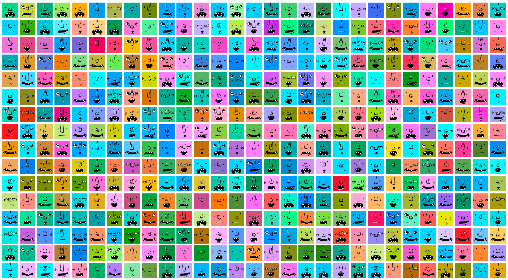
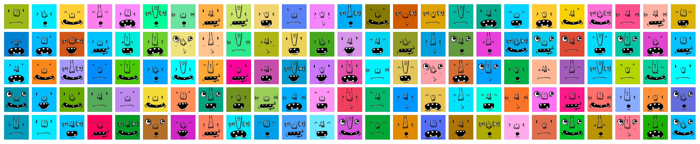
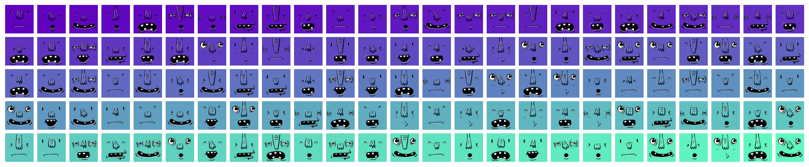

# go-adorable - Adorable Avatars from Go

The `go-adorable` project is a Go clone of [Adorable Avatars](http://avatars.adorable.io/), an image generator for user friendly placeholder avatars. This project's goal is to enable quickly onboarding users into social networks and providing a human centric starting experience.



## Usage

The library's [Go API](http://godoc.org/github.com/ipsn/go-adorable) is extremely simplistic, consisting of a handful of methods that can generate `png` images according to a few rules. The simplest is to just request a fully random image, which can generate 576 unique faces on a "limitless" background color palette.

```go
avatar := adorable.Random()

if err := ioutil.WriteFile("avatar.png", avatar, 0600); err != nil {
  panic(err)
}
```

### Determinism

Fully random images are useful for most purposes, but sometimes it may be desirable to assign a deterministic image to a specific user. This can be particularly handy for insta-onboarding or as a placeholder if no avatar is set.

```go
avatar := adorable.PseudoRandom([]byte("unique-user-id"))

if err := ioutil.WriteFile("avatar.png", avatar, 0600); err != nil {
  panic(err)
}
```



The deterministic avatars may be further restricted to a specific background palette, enabling finer tuned placeholders for default images (e.g. grayscale or other neutral colors). *Note, that the images below are the same deterministic ones as above, just with fixed colors.*

```go
scheme := color.RGBA{R: 96, G: 128, B: 192, A: 255}
avatar := adorable.PseudoRandomWithColor([]byte("unique-user-id"), scheme)

if err := ioutil.WriteFile("avatar.png", avatar, 0600); err != nil {
  panic(err)
}
```



### Demo

The repository also contains a small demo which lists a few hundred avatars created with different invocation rules. It should be a good staring point if you get stuck or want to play around with the generator and quickly see a summary of the results. You can run it via:

```
$ go run ./samples.go
```

## Credits

This repository is maintained by Péter Szilágyi ([@karalabe](https://github.com/karalabe)), but authorship of the images belongs to the original [avatars-api-middleware](https://github.com/adorableio/avatars-api-middleware) project and its artists, Kelly Rauwerdink ([@missingdink](https://github.com/missingdink)) and Kevin Altman ([@itsthatguy](https://github.com/itsthatguy)).

## License

[Same as original](https://github.com/adorableio/avatars-api-middleware), MIT.
